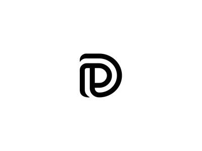

#Delani studio



### description
This is a studio program that helps one practice the various jquery concepts.
## Getting Started

Install Delani Studios on your local machine by cloning this online repository:

[Delani Studios repo](https://github.com/ArnoldOduma/Delani_Studio)
### Installing
```
  git init 
  git clone https://github.com/ArnoldOduma/Delani_Studio
```
* After cloning successfully, got to the offline directory.
* Open the index.html file in your favorite browser. And enjoy.
*You are set to go. Feel free to edit any of the custom files.
## Built With

* [HTML]
* [CSS]
* [JQUERY]
* [JAVASCRIPT]
## Contacts

[Email]markmumba01@gmail.com <br>
instagram - m.u.m.b.a_
## License

This project is licensed under the MIT License 


